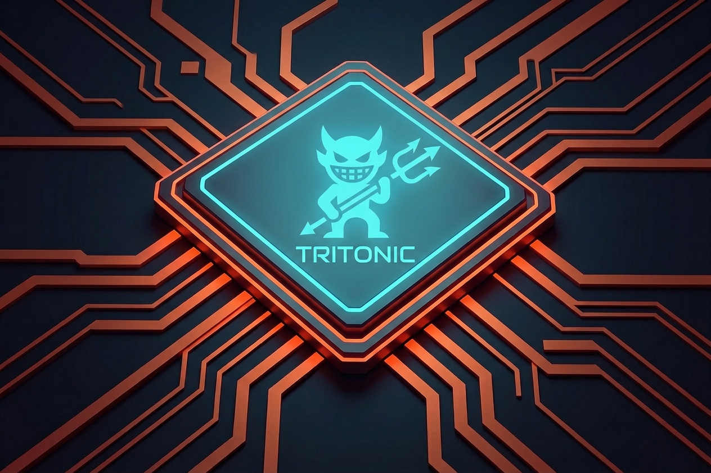

# TritonIC - C++ Inference Client

[](https://github.com/olibartfast/tritonic/actions/workflows/ci.yml)

TritonIC is a C++ application that supports two complementary inference modes:

- **Triton backend** — computer vision tasks (object detection, segmentation, classification, optical flow, pose, depth) via the [NVIDIA Triton Inference Server](https://github.com/triton-inference-server/server) over HTTP or gRPC.
- **Chat backend** — text and multimodal generation via any OpenAI-compatible `/v1/chat/completions` endpoint (Ollama, llama.cpp, SGLang, vLLM, OpenAI, etc.).

The two backends are complementary: use Triton for real-time computer vision at high throughput; use the Chat backend for VLMs and LLMs without a Triton server.

> 🚧 Status: Under Development — expect frequent updates.

## Table of Contents
- [Project Structure](#project-structure)
- [Architecture](#architecture)
- [Tested Models](#tested-models)
- [Build Client Libraries](#build-client-libraries)
- [Dependencies](#dependencies)
- [Build and Compile](#build-and-compile)
- [Tasks](#tasks)
- [Notes](#notes)
- [Deploying Models](#deploying-models)
- [Running Inference](#running-inference)
  - [Triton backend](#command-line-inference-on-video-or-image)
  - [Chat backend](#chat-backend-openai-compatible)
- [Docker Support](#docker-support)
- [Kubernetes Deployment](#kubernetes-deployment)
- [Demo](#demo)
- [References](#references)
- [Feedback](#feedback)

## Project Structure

```
tritonic/
├── src/
│   ├── main/                     # Entry point (client.cpp), App, Logger, ConfigManager
│   ├── triton/                   # Triton client (Triton.hpp/.cpp, forwarding headers)
│   ├── chat/                     # OpenAI-compatible backend (ChatBackend, ChatSession)
│   └── common/                   # Shared forwarding headers
├── include/
│   ├── tritonic/                 # Canonical namespaced headers
│   │   ├── core/                 # types.hpp, interfaces.hpp
│   │   ├── triton/               # model_info.hpp, itriton.hpp, triton_backend.hpp
│   │   ├── chat/                 # ichat_backend.hpp
│   │   └── infra/                # logger.hpp, config.hpp, config_manager.hpp
│   └── *.hpp                     # Backward-compat forwarding headers
├── deploy/                       # Model export scripts (per task type)
├── scripts/                      # Docker, setup, and utility scripts
├── config/                       # Configuration files
├── docs/                         # Documentation and guides
├── labels/                       # Label files (COCO, ImageNet, etc.)
├── data/                         # Data files (images, videos, outputs)
└── tests/                        # Unit and integration tests
```

**CMake Fetched Dependencies:**
- [neuriplo-tasks](https://github.com/olibartfast/neuriplo-tasks) (v0.6.0) — model pre/post processing and task management

## Architecture

TritonIC selects an inference backend at startup via `--backend`:

| `--backend` | Requires | Best for |
|-------------|----------|----------|
| `triton` (default) | NVIDIA Triton server | CV tasks — detection, segmentation, classification, optical flow, pose, depth |
| `chat` | Any OpenAI-compatible server | LLMs, VLMs, multimodal chat |

The two modes are **not competing** — Triton handles binary tensor workloads at real-time throughput, while the Chat backend handles text/image generation over a REST API. Choose based on your model and server.

Both implement the common `tritonic::core::IInferenceBackend` interface (Strategy pattern), enabling clean dependency injection and unit testing without live servers.

> Note: "backend" here refers to *tritonic's* server selection (`--backend=triton` vs `--backend=chat`). This is distinct from the Triton server's own *framework backends* (TensorRT, ONNX Runtime, etc.), which are configured server-side.

For full code structure and namespace layout see [AGENTS.md](AGENTS.md).

The YOLO DALI ensemble can accept original JPEG bytes and run decode,
letterboxing, normalization, and TensorRT inference on the server. See the
[reproducible GPU-preprocessing workflow](deploy/object_detection/yolo/ensemble/README.md)
and its [atomic implementation roadmap](docs/ENSEMBLE_INFERENCE_ROADMAP.md).

## Tested Models

## Object Detection

- [YOLOv5](https://github.com/ultralytics/yolov5)
- [YOLOv6](https://github.com/meituan/YOLOv6)
- [YOLOv7](https://github.com/WongKinYiu/yolov7)
- [YOLOv8/YOLO11/YOLO26](https://github.com/ultralytics/ultralytics)
- [YOLOv9](https://github.com/WongKinYiu/yolov9)
- [YOLOv10](https://github.com/THU-MIG/yolov10)
- [YOLOv12](https://github.com/sunsmarterjie/yolov12)
- [YOLO-NAS](https://github.com/Deci-AI/super-gradients)
- [RT-DETR](https://github.com/lyuwenyu/RT-DETR/tree/main/rtdetr_pytorch)
- [RT-DETRv2](https://github.com/lyuwenyu/RT-DETR/tree/main/rtdetrv2_pytorch)
- [RT-DETRv4](https://github.com/RT-DETRs/RT-DETRv4)
- [D-FINE](https://github.com/Peterande/D-FINE)
- [DEIM](https://github.com/ShihuaHuang95/DEIM)
- [DEIMv2](https://github.com/Intellindust-AI-Lab/DEIMv2)
- [RF-DETR](https://github.com/roboflow/rf-detr)

## Instance Segmentation

- [YOLOv5](https://github.com/ultralytics/yolov5)
- [YOLOv8/YOLO11/YOLO26](https://github.com/ultralytics/ultralytics)
- [YOLOv10](https://github.com/THU-MIG/yolov10)
- [YOLOv12](https://github.com/sunsmarterjie/yolov12)
- [RF-DETR-Seg](https://github.com/roboflow/rf-detr)

## Classification

- [Torchvision Models](https://pytorch.org/vision/stable/models.html)
- [TensorFlow-Keras Models](https://www.tensorflow.org/api_docs/python/tf/keras/applications)
- [Hugging Face Vision Transformers (ViT)](https://huggingface.co/docs/transformers/model_doc/vit)

## Optical Flow

- [RAFT](https://pytorch.org/vision/stable/models/raft.html)

## Open Vocabulary Detection

- [OWLv2](https://huggingface.co/google/owlv2-base-patch16-ensemble)
- [OWL-ViT](https://huggingface.co/google/owlvit-base-patch32)
- [Grounding DINO](https://github.com/IDEA-Research/GroundingDINO)

## Pose Estimation

- [YOLOv5 Pose](https://github.com/ultralytics/yolov5)
- [YOLOv8/YOLO11/YOLO26 Pose](https://github.com/ultralytics/ultralytics)
- [ViTPose](https://github.com/ViTAE-Transformer/ViTPose)
- [RF-DETR Keypoints](https://github.com/roboflow/rf-detr) (single-stage person keypoints, 17 COCO keypoints)
- [YOLOv5 Pose](https://github.com/ultralytics/yolov5)
- [YOLOv8/YOLO11/YOLO26 Pose](https://github.com/ultralytics/ultralytics)

## Video Classification

- [VideoMAE](https://github.com/MCG-NJU/VideoMAE)
- [ViViT](https://github.com/google-research/scenic/tree/main/scenic/projects/vivit)
- [TimeSformer](https://github.com/facebookresearch/TimeSformer)

## Depth Estimation

- [Depth Anything V2](https://github.com/ibaiGorordo/Depth-Anything-V2)

## Image Understanding (VLM)

- [Gemma 4](https://ai.google.dev/gemma/docs) and compatible vision-language models via llama.cpp (image captioning, visual Q&A)
- LLaVA, LLaMA3-V, and other multimodal models via OpenAI-compatible endpoints


## Build Client Libraries

To build the client libraries, refer to the official [Triton Inference Server client libraries](https://github.com/triton-inference-server/client/tree/r25.06).

### Alternative: Extract Client Libraries from Docker

For convenience, you can extract the pre-built Triton client libraries from the official NVIDIA Triton Server SDK image using [Docker](docs/guides/Docker_setup.md):

```bash
# Run the extraction script
./docker/scripts/extract_triton_libs.sh
```

This script will:
1. Create a temporary Docker container from the `nvcr.io/nvidia/tritonserver:25.06-py3-sdk` image
2. Extract the Triton client libraries from `/workspace/install`
3. Copy additional Triton server headers and libraries if available
4. Save everything to `./triton_client_libs/` directory

After extraction, set the environment variable:
```bash
export TritonClientBuild_DIR=$(pwd)/triton_client_libs/install
```

The extracted directory structure will contain:
- `install/` - Triton client build artifacts
- `triton_server_include/` - Triton server headers  
- `triton_server_lib/` - Triton server libraries
- `workspace/` - Additional workspace files

## Dependencies

Ensure the following dependencies are installed:

1. **Nvidia Triton Inference Server**:
```bash
docker pull nvcr.io/nvidia/tritonserver:25.06-py3
```

2. **Triton client libraries**: Tested on Release r25.06
3. **Protobuf and gRPC++**: Versions compatible with Triton
4. **RapidJSON**:
```bash
apt install rapidjson-dev
```

5. **libcurl**:
```bash
apt install libcurl4-openssl-dev
```

6. **OpenCV 4**: Tested version: 4.7.0
```bash
apt install libopencv-dev
```

## Development Setup

### Pre-commit Hooks (Recommended)

To maintain code quality and consistency, install pre-commit hooks:

```bash
# Run the setup script
./scripts/setup/pre_commit_setup.sh

# Or install manually
pip install pre-commit
pre-commit install
```

### Build and Compile

1. Set the environment variable `TritonClientBuild_DIR` or update the `CMakeLists.txt` with the path to your installed Triton client libraries.

2. Create a build directory:
```bash
mkdir build
```

3. Navigate to the build directory:
```bash
cd build
```

4. Run CMake to configure the build:
```bash
cmake -DCMAKE_BUILD_TYPE=Release ..
```

Optional flags:
- `-DSHOW_FRAME`: Enable to display processed frames after inference
- `-DWRITE_FRAME`: Enable to write processed frames to disk

5. Build the application:
```bash
cmake --build .
```

## Tasks

### Export Instructions
- [Object Detection](https://github.com/olibartfast/neuriplo-tasks/blob/master/export/detection/ObjectDetection.md)
- [Classification](https://github.com/olibartfast/neuriplo-tasks/blob/master/export/classification/Classification.md)
- [Instance Segmentation](https://github.com/olibartfast/neuriplo-tasks/blob/master/export/segmentation/InstanceSegmentation.md)
- [Optical Flow](https://github.com/olibartfast/neuriplo-tasks/blob/master/export/optical_flow/OpticalFlow.md)
- [Open Vocabulary Detection](https://github.com/olibartfast/neuriplo-tasks/blob/master/export/open_vocab_detection/OpenVocabDetection.md)
- [Pose Estimation](https://github.com/olibartfast/neuriplo-tasks/blob/master/export/pose_estimation/PoseEstimation.md)
- [Video Classification](https://github.com/olibartfast/neuriplo-tasks/blob/master/export/video_classification/VideoClassification.md)
- [Depth Estimation](https://github.com/olibartfast/neuriplo-tasks/blob/master/export/depth_estimation/DepthEstimation.md)

*Other tasks are in TODO list.*

## Notes

Ensure the model export versions match those supported by your Triton release. Check Triton releases [here](https://github.com/triton-inference-server/server/releases).

## Deploying Models

To deploy models, set up a model repository following the [Triton Model Repository schema](https://github.com/triton-inference-server/server/blob/main/docs/user_guide/model_repository.md). The `config.pbtxt` file is optional unless you're using the OpenVino backend, implementing an Ensemble pipeline, or passing custom inference parameters.

### Model Repository Structure
```
<model_repository>/
    <model_name>/
        config.pbtxt
        <model_version>/
            <model_binary>
```

### Starting Triton Server

Use the provided script for easy setup:
```bash
# Start Triton server with GPU support
./docker/scripts/docker_triton_run.sh /path/to/model_repository 25.06 gpu

# Start with CPU only
./docker/scripts/docker_triton_run.sh /path/to/model_repository 25.06 cpu
```

Or manually with Docker:
```bash
docker run --gpus=1 --rm \
  -p 8000:8000 -p 8001:8001 -p 8002:8002 \
  -v /full/path/to/model_repository:/models \
  nvcr.io/nvidia/tritonserver:<xx.yy>-py3 tritonserver \
  --model-repository=/models
```

*Omit the `--gpus` flag if using the CPU version.*

## Running Inference

### Command-Line Inference on Video or Image
```bash
./tritonic \
    --source=/path/to/source.format \
    --model_type=<model_type> \
    --model=<model_name_folder_on_triton> \
    --labelsFile=/path/to/labels/coco.names \
    --protocol=<http or grpc> \
    --serverAddress=<triton-ip> \
    --port=<8000 for http, 8001 for grpc> \
```

For dynamic input sizes:
```bash
    --input_sizes="c,h,w"
```

### Shared Memory Support

Tritonic supports shared memory to improve inference performance by reducing data copying between the client and Triton server. Two types of shared memory are available:

#### System (POSIX) Shared Memory
Uses CPU-based shared memory for efficient data transfer:
```bash
./tritonic \
    --source=/path/to/source.format \
    --model=<model_name> \
    --shared_memory_type=system \
    ...
```

#### CUDA Shared Memory
Uses GPU memory directly for zero-copy inference (requires GPU support):
```bash
./tritonic \
    --source=/path/to/source.format \
    --model=<model_name> \
    --shared_memory_type=cuda \
    --cuda_device_id=0 \
    ...
```

**Configuration Options:**
- `--shared_memory_type` or `-smt`: Shared memory type (`none`, `system`, or `cuda`). Default: `none`
- `--cuda_device_id` or `-cdi`: CUDA device ID when using CUDA shared memory. Default: `0`

### Quick Start with Docker Scripts

Use the provided Docker scripts for quick testing:

```bash
# Run object detection
./docker/scripts/run_client.sh

# Run with debug mode
./docker/scripts/run_debug.sh

# Run optical flow
./docker/scripts/run_optical_flow.sh

# Run unit tests
./docker/scripts/run_tests.sh
```

#### Debugging Tips
Check [`.vscode/launch.json`](.vscode/launch.json) for additional configuration examples

#### Placeholder Descriptions
- **`/path/to/source.format`**: Path to the input video or image file, for optical flow you must pass two images as comma separated list
- **`<model_type>`**: Model type (e.g., `yolov5`, `yolov8`, `yolo11`, `yoloseg`, `torchvision-classifier`, `tensorflow-classifier`, `vit-classifier`, check below [Model Type Parameters](#model-type-tag-parameters))
- **`<model_name_folder_on_triton>`**: Name of the model folder on the Triton server
- **`/path/to/labels/coco.names`**: Path to the label file (e.g., COCO labels)
- **`<http or grpc>`**: Communication protocol (`http` or `grpc`)
- **`<triton-ip>`**: IP address of your Triton server
- **`<8000 for http, 8001 for grpc>`**: Port number
- **`<batch or b >`**: Batch size. For compatible independent-image models (classification, detection, segmentation, pose, depth, open-vocab) with `max_batch_size > 1` in the model config, automatic batching groups up to this many images into a single inference call, capped by the model `max_batch_size`.
- **`<inference_timeout or it>`**: Inference timeout in milliseconds. `0` keeps the backend default; positive values apply to chat HTTP requests, Triton infer requests, and model-load readiness waits.
- **`<input_sizes or -is>`**: Input sizes input for dynamic axes. Semi-colon separated list format: CHW;CHW;... (e.g., '3,224,224' for single input or '3,224,224;3,224,224' for two inputs, '3,640,640;2' for rtdetr/dfine models)


To view all available parameters, run:
```bash
./tritonic --help
```

#### Model Type Tag Parameters
| Model                  | Model Type Parameter   | Notes |
|------------------------|------------------------|-------|
| YOLOv5 / v6 / v7 / v8 / v9 / v11 / v12 | `yolo` | Any `yolo*` variant works. Standard format |
| YOLOv7 End-to-End      | `yolov7e2e`            | Only for YOLOv7 exported with `--grid --end2end` flags (requires TensorRT backend) |
| YOLOv10                | `yolov10`              | Specific output format |
| YOLO26                | `yolo26`              | Specific output format (i.e. is the same of yolov10) |
| YOLO-NAS               | `yolonas`              | Specific output format |
| RT-DETR / RT-DETRv2 / RT-DETRv4 / D-FINE / DEIM / DEIMv2 | `rtdetr` | All RT-DETR style models share the same postprocessor |
| RT-DETR Ultralytics    | `rtdetrul`             |       |
| RF-DETR Detection | `rfdetr`  |       |
| YOLOv5/v8/v11/v12 Segmentation | `yoloseg`       |       |
| YOLO26 Segmentation | `yolo26seg`       |       |
| YOLOv10 Segmentation | `yolov10seg`       |    
| RF-DETR Segmentation | `rfdetrseg`  |       |
| Torchvision Classifier | `torchvision-classifier` |     |
| Tensorflow Classifier  | `tensorflow-classifier` |      |
| ViT Classifier         | `vit-classifier`       |       |
| RAFT Optical Flow      | `raft`                 |       |
| VideoMAE               | `videomae`             | 16-frame sliding window video |
| ViViT                  | `vivit`                | Video Transformer |
| TimeSformer            | `timesformer`          | Video Transformer |
| ViTPose                | `vitpose`              | Pose estimation (COCO 17 keypoints) |
| Depth Anything V2      | `depth_anything_v2`    | Monocular depth estimation |
| OWLv2                  | `owlv2`                | Open-vocabulary detection |
| OWL-ViT                | `owlvit`               | Open-vocabulary detection |
| Grounding DINO         | `grounding_dino`       | Open-vocabulary detection |
| RF-DETR Keypoints      | `rfdetr_keypoints`     | Single-stage person keypoints (17 COCO) |
| YOLOv5 Pose            | `yolov5pose`           | Pose estimation |
| YOLOv8 Pose            | `yolov8pose`           | Pose estimation |
| YOLO11 Pose            | `yolo11pose`           | Pose estimation |
| YOLO26 Pose            | `yolo26pose`           | Pose estimation |

### Chat Backend (OpenAI-compatible)

Skip Triton entirely and query any OpenAI-compatible server. Works with Ollama, llama.cpp, SGLang, vLLM, OpenAI, Together AI, OpenRouter, and Z.AI.

**Single-turn with an image:**
```bash
./tritonic \
    --backend=chat \
    --api_endpoint=http://localhost:11434/v1/chat/completions \
    --model=llava:7b \
    --text_prompt="Describe what you see" \
    --source=/path/to/image.jpg
```

**Interactive multi-turn session:**
```bash
./tritonic \
    --backend=chat \
    --api_endpoint=http://localhost:11434/v1/chat/completions \
    --model=llava:7b \
    --text_prompt="You are a helpful assistant" \
    --interactive
```

**OpenRouter multimodal with Kimi K2.6:**
```bash
export OPENROUTER_API_KEY=...

./tritonic \
    --backend=chat \
    --api_service=openrouter \
    --model=moonshotai/kimi-k2.6 \
    --text_prompt="Describe the scene and read any visible text." \
    --source=/path/to/image.jpg
```

**Together AI text-only with GLM-5.1:**
```bash
export TOGETHER_API_KEY=...

./tritonic \
    --backend=chat \
    --api_service=together \
    --model=zai-org/GLM-5.1 \
    --text_prompt="Summarize the design tradeoffs in this architecture."
```

**Z.AI multimodal with GLM-4.6V:**
```bash
export ZAI_API_KEY=...

./tritonic \
    --backend=chat \
    --api_service=zai \
    --model=glm-4.6v \
    --text_prompt="Describe the image and extract the key objects." \
    --source=/path/to/image.jpg
```

`GLM-5.1` is available on Together AI and Z.AI, but it is text-only. For GLM-family image input, use `GLM-4.6V`.

**Chat CLI parameters:**

| Parameter | Short | Default | Description |
|-----------|-------|---------|-------------|
| `--backend` | `be` | `triton` | `triton` or `chat` |
| `--api_endpoint` | `ae` | — | Full URL, e.g. `http://localhost:11434/v1/chat/completions` |
| `--api_service` | `as` | — | Service preset: `openai`, `openrouter`, `together`, `zai` |
| `--api_key_env` | `ak` | — | Env-var name that holds the API key (e.g. `OPENAI_API_KEY`) |
| `--text_prompt` | `tp` | — | System prompt (interactive) or user prompt (single-turn) |
| `--max_tokens` | `mxt` | `256` | Max tokens to generate |
| `--temperature` | `temp` | `1.0` | Sampling temperature |
| `--target_image_size` | `tis` | `512` | Longest edge (px) before base64 encoding |
| `--interactive` | `ia` | `false` | Enable multi-turn REPL |
| `--inference_timeout` | `it` | `0` | Request timeout in milliseconds (`0` keeps backend default) |

## Docker Support
For detailed instructions on installing Docker and the NVIDIA Container Toolkit, refer to the [Docker Setup Document](docs/guides/Docker_setup.md).

### Build

```bash
docker build --rm -t tritonic -f docker/Dockerfile .
```

### Run Container
```bash
docker run --rm \
  -v /path/to/host/data:/app/data \
  tritonic \
  --network host \
  --source=<path_to_source_on_container> \
  --model_type=<model_type> \
  --model=<model_name_folder_on_triton> \
  --labelsFile=<path_to_labels_on_container> \
  --protocol=<http or grpc> \
  --serverAddress=<triton-ip> \
  --port=<8000 for http, 8001 for grpc>
```

## Kubernetes Deployment

For Kubernetes setup and deployment details, see:
- [Kubernetes Deployment Guide](docs/guides/Kubernetes_setup.md)
- [K8s Scripts Usage](k8s/scripts/README.md)

Quick start:
```bash
./k8s/scripts/check_and_deploy_triton.sh
```

This script performs:
1. `kubectl` installation check (and install if missing)
2. Kubernetes cluster liveness check — automatically starts or installs a local cluster (minikube → kind → k3s) if none is reachable; installs `kind` via Docker if no tool is present
3. NVIDIA GPU availability check inside cluster — installs `nvidia-container-toolkit` and the NVIDIA device plugin automatically if the host has a GPU
4. Triton deployment status check and reconciliation against the current manifests
5. Triton deploy or update (GPU or CPU manifest)
6. External Triton endpoint summary for the `NodePort` service

Default external access on minikube:
- HTTP: `http://$(minikube ip):30800`
- gRPC: `$(minikube ip):30801`
- Metrics: `http://$(minikube ip):30802/metrics`

Notes:
- The deployment uses the Triton `25.12-py3` image by default for Kubernetes.
- On minikube, if the Triton image is already present in host Docker, the deploy script loads it into the node before rollout to avoid long registry pulls.
- GPU deployments use the `Recreate` strategy so updates work on single-node, single-GPU clusters.

## Demo

Real-time inference test (GPU RTX 3060):
- YOLOv7-tiny exported to ONNX: [Demo Video](https://youtu.be/lke5TcbP2a0)
- YOLO11s exported to onnx: [Demo Video](https://youtu.be/whP-FF__4IM)
- RAFT Optical Flow Large(exported to traced torchscript): [Demo Video](https://www.youtube.com/watch?v=UvKCjYI_9aQ)

## References
- [Triton Inference Server Client Example](https://github.com/triton-inference-server/client/blob/r21.08/src/c%2B%2B/examples/image_client.cc)
- [Triton User Guide](https://docs.nvidia.com/deeplearning/triton-inference-server/user-guide/docs/getting_started/quickstart.html)
- [Triton Tutorials](https://github.com/triton-inference-server/tutorials)
- [ONNX Models](https://onnx.ai/models/)
- [Torchvision Models](https://pytorch.org/vision/stable/models.html)
- [Tensorflow Model Garden](https://github.com/tensorflow/models/tree/master/official)

## Feedback
Any feedback is greatly appreciated. If you have any suggestions, bug reports, or questions, don't hesitate to open an [issue](https://github.com/olibartfast/tritonic/issues). Contributions, corrections, and suggestions are welcome to keep this repository relevant and useful.
